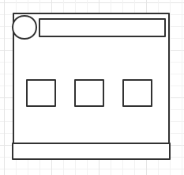
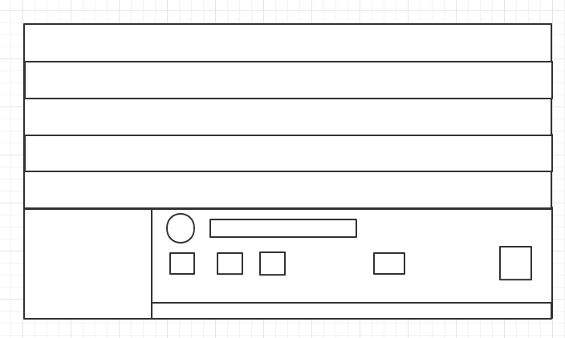

# @zxkfall/audio-player develop log

主版本号:次版本号:补丁版本号

主版本号:向下不兼容

次版本号:增加功能，向下兼容

Mini

Normal

### Tasking

### mini

#### 1.1.0

- [x] 创建mini HTML布局
- [x] 为mini布局添加css文件
- [x] 可以播放一首歌曲
- [x] 默认fixed布局，位于屏幕左下角
- [x] 可以播放多首歌曲并显示进度

#### 1.2.0

- [x] 可以调节音量大小
- [x] 实现静音功能
- [x] 切换上一首，下一首功能
- [x] 播放时播放图标改变

#### 1.3.0

- [x] 可以显示图片

#### 1.4.0

- [x] 鼠标悬浮时，添加蒙版，使图标更明显
- [x] 如果没有传入图片，可以从flac音乐中提取封面图

#### 1.5.0

- [ ] 如果没有传入图片，可以从mp3音乐中提取封面图

